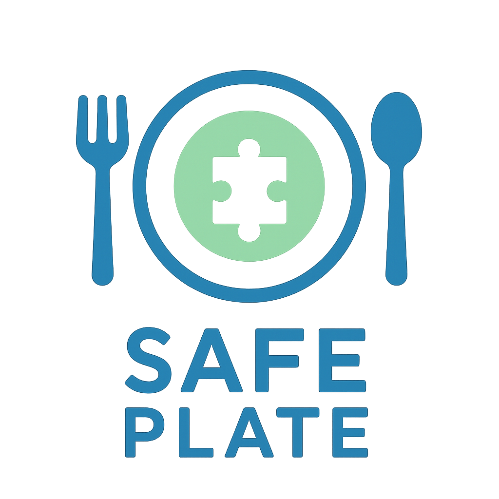

  

# SAFE PLATE 🍽️  
**Personalized Meal Planning for Autistic Individuals**

---

## 🌟 Overview
SAFE PLATE is a mobile application designed to support autistic individuals and their caregivers by offering **personalized, nutritious, and sensory-considerate meal planning**.  
The app respects dietary restrictions, sensory sensitivities, and cultural preferences, helping families maintain healthier and more consistent routines.  

---

## 👥 Team Members
- Bassmalla Hossam Ibrahim Saad Eldin  
- Rawan Mohy el din Abd el sabour Ahmed  
- Omar Ali Oweda Ahmed  
- Mostafa Ashraf Mostafa Elsayed  
- Shehab Ahmed Ali Ahmed Mohamed  

---

## 🛠️ Tools
- Adobe Photoshop  
- Adobe Illustrator  
- Figma  
- Adobe XD  

---

## 🎯 Core Features
- Personalized Meal Plans  
- Sensory-Friendly Recipes  
- Routine & Reminders  
- Caregiver/Parent Sync  
- Shopping List Integration  
- Accessibility Options  

---

## 📊 Market Need
- Over **75 million people** worldwide live with autism.  
- In Egypt, estimates suggest **800,000+ individuals** are on the spectrum.  
- Lack of localized, Arabic, and sensory-friendly meal planning tools creates a clear **market gap**.  

---

## 📌 Project Scope
- **UX Research:** User interviews, surveys, and personas with autistic individuals and caregivers.  
- **Information Architecture & User Flows:** Clear flows for meal planning, reminders, and caregiver sync.  
- **Design & Prototyping:** Low-fi wireframes, high-fi UI, and prototypes with low-stimulation layouts.  
- **Style Guide & Components:** Autism-friendly colors, fonts, and reusable design elements for developers.  
- **Development:** Personalized meal planning engine (allergies, sensory needs, nutrition goals) with cloud storage and offline support.  
- **Integration:** Auto-generated shopping lists, optional professional/dietitian input.  
- **Access:** Mobile app (iOS & Android) plus caregiver dashboard.  
- **Security:** Encrypted data, caregiver-controlled access, and privacy-first authentication.  

---

## 🚀 Future Roadmap
- [ ] Build MVP with core features  
- [ ] Pilot testing with families in Egypt  
- [ ] Add AI-based adaptive suggestions  
- [ ] Partnerships with schools, NGOs, and healthcare providers

---

## 🎨 Figma Link 
https://www.figma.com/design/RDkN6racnEnY7tthVVdfuc/Safe-Plate-Design?node-id=0-1&t=wluznmW7tkaN9Mqj-1

